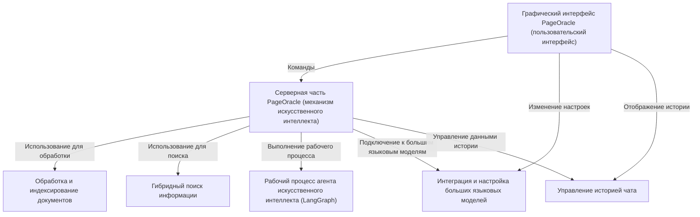

# 📖PageOracle: Мудрость в каждой странице.
PageOracle — это настольное приложение на базе искусственного интеллекта, разработанное для того, чтобы помочь пользователям взаимодействовать с книгами. Оно позволяет загружать книги (в формате .txt), задавать вопросы об их содержании и получать интеллектуальные ответы, сгенерированные искусственным интеллектом. Система преобразует книги в базу знаний с возможностью поиска, интегрируется с различными большими языковыми моделями и управляет историей ваших диалогов с помощью интуитивно понятного ИИ-агента на основе графов и удобного графического интерфейса.

## Визуальный обзор: как работает система

## Содержание по главам:
[Глава I. Работа с PageOracle](README.md#глава-II.-как-работает-pageoracle)
1. [Как пользоваться PageOracle](README.md#как-пользоваться-pageoracle)
2. [Пользовательский интерфейс (GUI)](README.md#пользовательский-интерфейс-gui)
3. [Примеры работы](README.md#примеры-работы)

[Глава II. Как работает PageOracle](README.md#%D0%B3%D0%BB%D0%B0%D0%B2%D0%B0-ii-%D0%BA%D0%B0%D0%BA-%D1%80%D0%B0%D0%B1%D0%BE%D1%82%D0%B0%D0%B5%D1%82-pageoracle)
1. [Обработка и индексирование документов](README.md#%D0%BE%D0%B1%D1%80%D0%B0%D0%B1%D0%BE%D1%82%D0%BA%D0%B0-%D0%B8-%D0%B8%D0%BD%D0%B4%D0%B5%D0%BA%D1%81%D0%B8%D1%80%D0%BE%D0%B2%D0%B0%D0%BD%D0%B8%D0%B5-%D0%B4%D0%BE%D0%BA%D1%83%D0%BC%D0%B5%D0%BD%D1%82%D0%BE%D0%B2)
2. [PageOracle Backend (движок искусственного интеллекта)](README.md#pageoracle-backend-%D0%B4%D0%B2%D0%B8%D0%B6%D0%BE%D0%BA-%D0%B8%D1%81%D0%BA%D1%83%D1%81%D1%81%D1%82%D0%B2%D0%B5%D0%BD%D0%BD%D0%BE%D0%B3%D0%BE-%D0%B8%D0%BD%D1%82%D0%B5%D0%BB%D0%BB%D0%B5%D0%BA%D1%82%D0%B0)
3. [Интеграция и настройка LLM](README.md#%D0%B8%D0%BD%D1%82%D0%B5%D0%B3%D1%80%D0%B0%D1%86%D0%B8%D1%8F-%D0%B8-%D0%BD%D0%B0%D1%81%D1%82%D1%80%D0%BE%D0%B9%D0%BA%D0%B0-llm)
4. [Управление историей чата](README.md#%D1%83%D0%BF%D1%80%D0%B0%D0%B2%D0%BB%D0%B5%D0%BD%D0%B8%D0%B5-%D0%B8%D1%81%D1%82%D0%BE%D1%80%D0%B8%D0%B5%D0%B9-%D1%87%D0%B0%D1%82%D0%B0)
5. [Гибридный поиск информации](README.md#%D0%B3%D0%B8%D0%B1%D1%80%D0%B8%D0%B4%D0%BD%D1%8B%D0%B9-%D0%BF%D0%BE%D0%B8%D1%81%D0%BA-%D0%B8%D0%BD%D1%84%D0%BE%D1%80%D0%BC%D0%B0%D1%86%D0%B8%D0%B8)
6. [Рабочий процесс ИИ-агента (LangGraph)](README.md#%D1%80%D0%B0%D0%B1%D0%BE%D1%87%D0%B8%D0%B9-%D0%BF%D1%80%D0%BE%D1%86%D0%B5%D1%81%D1%81-%D0%B8%D0%B8-%D0%B0%D0%B3%D0%B5%D0%BD%D1%82%D0%B0-langgraph)

## Глава I. Работа с PageOracle
### Как пользоваться PageOracle
#### Настройка и запуск PageOracle
1. Клонируете репозиторий или скачайте с сайта Github репозитория и перейдите в папку с программой:

```bash
git clone https://github.com/mrzolz19/pageoracle.git
```
```bash
cd pageoracle
```
2. Перейдите в папку `dependencies` 
```
cd dependencies
```
и установите необходмые зависимости:
```
pip install -r requirements.txt
```
Дождитесь установки всех пакетов

3. Предварительно поместите файлы книг с форматом `.txt.` в папку с программой
4. Запустите PageOracle
```
python gui.py
```
5. Зайдите в настройки и выберите:


 1. Провайдера ИИ: YandexGPT - рекомендуется по умолчанию, Deepseek, OpenAI, OpenRouter, Google, Anthropic, GigaChat
 2. LLM модель: yandexgpt-5.1/latest - рекомендуется по умолчанию. В зависимости от провайдера может быть deepseek-chat, gpt-5.4, gigachat-2 и т.д
 3. Embedding-модель - text-search-doc, nvidia/llama-nemotron-embed-vl-1b-v2:free (рекомендуется по умолчанию) - онлайн модели, но нужен [API ключ](https://openrouter.ai/workspaces/default/keys) OpenRouter или [API](https://aistudio.yandex.ru/platform) AIYandexStudio, BAAI/bge-m3 - локальная модель.
 4. API ключ от LLM - вставьте свой API ключ от LLM провайдера которого вы используете:
     [OpenRouter](https://openrouter.ai/workspaces/default/keys), 
     [GigaChat](https://developers.sber.ru/studio/workspaces/) 
     [Deepseek](https://platform.deepseek.com/api_keys)
     [Google](https://aistudio.google.com/app/api-keys)
     [Openai](https://platform.openai.com/)
     [Anthropic](https://platform.claude.com/)
     [Yandex](https://aistudio.yandex.ru/platform), также необходим индетификатор каталога, интструкция [тут](https://yandex.cloud/ru/docs/resource-manager/operations/folder/get-id)
 6. API ключ embedding-модели: см. пункт 4.
    
5. Принудительно выберите режим работы при необходимости:

- "Авто": автоматически выбирает в зависимости от запроса пользователя между "Анализом" и "Поиском цитат";
- "Анализ": отвечает на вопрос пользователя (например: «Что произошло с Наташей и Пьером в эпилоге романа "Война и мир"?»);
- "Поиск цитат": ищет фрагмент текста по запросу пользователя (Например, «Найди, где говорится про...»)


6. Введите ваш запрос в поле ввода и дождитесь ответа от ИИ.

### Пользовательский интерфейс (GUI)

1.	Что такое GUI: Это визуальная «панель управления» программой, заменяющая сложные текстовые команды на кнопки и окна. В PageOracle он реализован на языке Python с помощью библиотеки Tkinter.


<ol start="2">
  <li> Основные элементы:</li> 
  <ul>
    <li><strong>Боковая панель:</strong> кнопки загрузки книг и настроек.</li>
    <li><strong>Область чата:</strong>
      <ul>
        <li>История диалога с ИИ</li>
        <li>Поле ввода запросов:</li>
        <ol type="1">
          <li>отправка сообщений или можно нажать "Enter"</li>
          <li>очистка окна чата (без очистки истории сообщений)</li>
          <li>очистка истории диалоги из памяти</li>
        </ol>
      </ul>
    </li>
    <li><strong>Системные журналы:</strong> панель внизу для отслеживания фоновых процессов (логов).</li>
  </ul>
  <li> Алгоритм работы: GUI выступает посредником. Когда пользователь нажимает кнопки, интерфейс передает запросы на бэкенд (логическую часть), где происходит основная обработка данных. В коде за структуру окна отвечает класс PageOracleApp.</li>
  <li> Программная реализация: Глава знакомит с базовыми виджетами Tkinter:</li>
  <ul>
  <li> tk.Tk — главное окно;</li>
  <li> Button — интерактивные кнопки;</li>
  <li> Entry — строка для ввода текста;</li>
  <li> Text — многострочное поле для вывода истории чата (с защитой от редактирования через state="disabled");</li>
  <li> Toplevel — всплывающие окна (например, для настроек).</li>
  </ul>
</ol>

### Примеры работы

## Глава II. Как работает PageOracle
### Обработка и индексирование документов

1. Проблема: Модели ИИ не могут прочитать огромную книгу целиком за один раз из-за ограничений памяти. Чтобы ИИ мог быстро находить ответы, книгу нужно систематизировать.
2. Этапы обработки (конвейер):<br>
  •  Загрузка: Чтение .txt файла с помощью инструмента TextLoader.<br>
  •  Аннотация (структурирование): Программа использует регулярные выражения, чтобы найти в тексте заголовки «ЧАСТЬ» или «ГЛАВА» и пометить фрагменты метаданными.<br>
  •  Дробление (Чанкинг): Текст разбивается на мелкие кусочки (чанки) по 1000 символов с перекрытием в 200 символов. Перекрытие нужно, чтобы не потерять контекст на стыках фрагментов.<br>
  •  Создание эмбеддингов: Текстовые фрагменты преобразуются в числовые векторы (математические «отпечатки» смысла) с помощью модели BAAI/bge-m3.<br>
  •  Сохранение в Vector Store: Все данные записываются в векторную базу данных Chroma.<br>
3. Технический стек: Используются библиотеки LangChain для работы с документами и дробления текста, а также HuggingFace для генерации векторов.

### PageOracle Backend (движок искусственного интеллекта)

1. Оркестратор (класс PageOracleBackend): Это центральный контроллер, который управляет загрузкой книг, инициализирует нейросети (LLM) и контролирует весь процесс подготовки ответа.
2. Связующее звено: Бэкенд объединяет три элемента: пользовательский вопрос, базу знаний (фрагменты книг) и мощь искусственного интеллекта.
3. Поиск и извлечение (Retrieval): Система использует «поисковых собак» (ретриверы), чтобы мгновенно находить в книгах именно те абзацы, которые нужны для ответа.
4. Промпт-инжиниринг: Бэкенд готовит для ИИ детальные инструкции (промпты), чтобы тот не «галлюцинировал», а отвечал строго по тексту книг или давал точные цитаты.
5. Реализация ответа:<br>
•  Метод initialize: Загружает книги, подготавливает векторное хранилище и подключает выбранную модель ИИ.<br>
•  Метод _create_chains: Создает логические цепочки (RAG-цепочки) для разных стилей ответов (аналитика или цитирование).<br>
•  Метод ask: Главная точка входа. Он запускает сложный многоэтапный процесс через LangGraph, который анализирует вопрос, ищет контекст и формулирует итоговый ответ.<br>

### Интеграция и настройка LLM

1. Универсальный интерфейс: Система работает как «универсальный пульт», позволяя легко переключаться между разными ИИ-провайдерами (OpenAI, DeepSeek, Anthropic и др.) в одном приложении.
2. Ключевые параметры настройки:
  •  API-ключ: Секретный пароль для доступа к выбранной нейросети.<br>
  •  Температура: Регулирует «креативность» (0.1 — строгие факты, 1.0 — творческие ответы).<br>
  •  Максимум токенов: Ограничивает длину ответа ИИ.<br>
3. Гибкость: Пользователь может сам выбирать «мозг» для своей задачи: одну модель для быстрого поиска, другую — для глубокого анализа текста.
4. Техническая реализация:
<ul>
    <li> В интерфейсе (GUI): Создано окно настроек с выпадающими списками провайдеров и моделей, а также полями для ввода ключей и числовых параметров.</li>
    <li> В коде (Backend):</li>
    <ul>
      <li> Используется словарь PROVIDERS, который хранит данные о том, какие библиотеки нужно подгрузить для каждого ИИ.</li>
      <li> Метод set_model динамически подключает нужную модель, устанавливает API-ключ и обновляет внутренние алгоритмы (цепочки и графы) под новую нейросеть.</li>
    </ul>
</ul>
  
### Управление историей чата

1. Зачем нужна история: Без памяти каждый новый вопрос воспринимается ИИ как первый. История позволяет ИИ понимать, о ком или о чем шла речь в предыдущих репликах (например, понимать местоимения «он», «его», «там»).
2. Ключевые концепции:<br>
  •  Банк памяти: Диалог хранится в виде списка сообщений с ролями «пользователь» и «помощник».<br>
  •  Обрезка истории: Чтобы не перегружать ИИ и не замедлять работу, программа хранит и отправляет только последние сообщения (короткая память).<br>
  •  Сохранение в файл: История записывается в файл chat_history.json, что позволяет продолжить диалог даже после перезапуска приложения.<br>
3. Техническая реализация:<br>
  •  В бэкенде (main.py) используется список словарей history.<br>
  •  Метод get_recent_history_for_prompt преобразует этот список в формат объектов LangChain (HumanMessage, AIMessage), который понимает языковая модель.<br>
  •  Методы save_history и load_history отвечают за работу с JSON-файлом.<br>
4. Различие функций в GUI:<br>
  •  «Очистить чат»: удаляет сообщения только с экрана, но ИИ всё еще помнит контекст.<br>
  •  «Очистить историю»: полностью стирает память ИИ и удаляет файл истории.<br>

### Гибридный поиск информации

1. Проблема: Обычный поиск по ключевым словам не понимает смысл, а поиск по смыслу (семантический) иногда бывает слишком расплывчатым.
2. Решение — Гибридный поиск: Система объединяет два метода:<br>
  •  Семантический поиск: Находит фрагменты по смыслу (через эмбеддинги), даже если слова не совпадают.<br>
  •  Поиск по ключевым словам (BM25): Находит точные совпадения терминов и названий.<br>
3. Переоценка (Re-ranking): После получения результатов из обоих источников в дело вступает специальная модель — кросс-кодировщик. Она еще раз внимательно сравнивает вопрос пользователя с найденными отрывками и выбирает ТОП-5 самых лучших.
4. Техническая реализация:<br>
•  PrefixedEmbeddings: Улучшает понимание вопроса нейросетью за счет специальных префиксов.<br>
•  SimpleReranker: «Умный фильтр», который отсеивает лишнее и ранжирует отрывки по релевантности.<br>
•  HybridRerankerRetriever: Главный компонент (оркестратор), который запускает оба поиска, удаляет дубликаты и передает отобранный контекст ИИ-агенту.<br>

### Рабочий процесс ИИ-агента (LangGraph)

1. Суть ИИ-агента: В отличие от обычного запроса к нейросети, агент выполняет задачу в несколько этапов. Он сам решает: нужно ли искать информацию в книге, достаточно ли найденного контекста или стоит перефразировать вопрос для более точного поиска.
2. Механизм LangGraph: Процесс представлен в виде графа (блок-схемы), состоящего из:<br>
  •  Узлов (Nodes): конкретных действий (поиск, оценка данных, переписывание вопроса, генерация ответа).<br>
  •  Ребер (Edges): связей между ними. Условные ребра позволяют агенту менять путь в зависимости от результата (например, если поиск не дал плодов, уйти на круг «переписывания вопроса»).<br>
  •  Состояния (State): общей «памяти» процесса, которая передается от узла к узлу.<br>
3. Основные этапы процесса в PageOracle:<br>
  •  Начальное решение: Агент анализирует вопрос и решает, использовать ли инструмент поиска или ответить сразу (если вопрос общий).<br>
  •  Извлечение и оценка: Вызывается инструмент поиска. После получения данных агент оценивает их релевантность.<br>
  •  Самокоррекция: Если информации мало, узел rewrite_question создает новый, улучшенный поисковый запрос.<br>
  •  Финал: Когда контекста достаточно, формируется итоговый аналитический ответ.<br>
4. Техническая часть: В коде (main.py) это реализуется через создание StateGraph, регистрацию узлов-функций и компиляцию готового приложения-агента.

