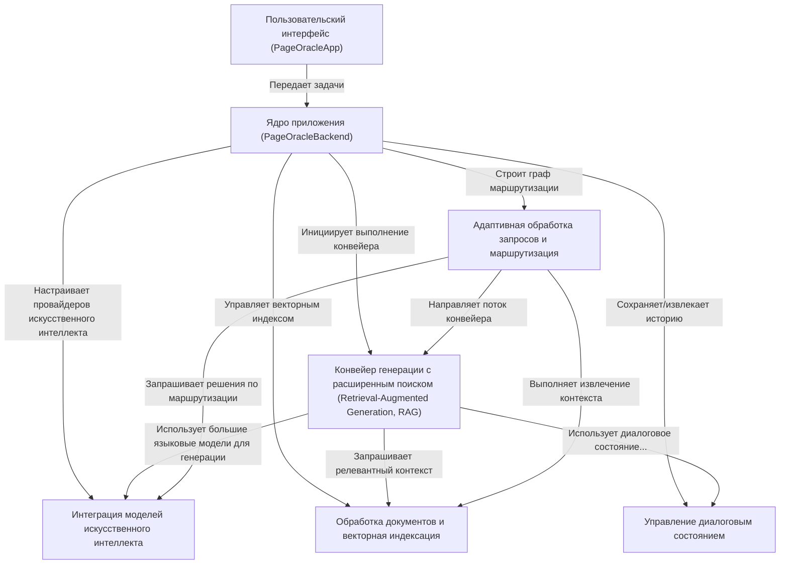

# 📖PageOracle: Мудрость в каждой странице.
📖PageOracle — это программа для чтения книг на основе искусственного интеллекта, которая позволяет пользователям загружать текстовые документы и задавать вопросы об их содержании. Она интеллектуально обрабатывает книги, использует передовые модели искусственного интеллекта для поиска нужной информации, а затем генерирует точные, контекстно-зависимые ответы или цитаты — и все это с помощью интуитивно понятного графического интерфейса.

## ✨Визуальный обзор: как работает система


## Содержание по главам:
[Глава I. Работа с PageOracle](README.md#глава-II.-как-работает-pageoracle)
1. [Как пользоваться PageOracle](README.md#как-пользоваться-pageoracle)
2. [Пользовательский интерфейс (GUI)](README.md#пользовательский-интерфейс-gui)
3. [Примеры работы](README.md#примеры-работы)

[Глава II. Как работает PageOracle](README.md#%D0%B3%D0%BB%D0%B0%D0%B2%D0%B0-ii-%D0%BA%D0%B0%D0%BA-%D1%80%D0%B0%D0%B1%D0%BE%D1%82%D0%B0%D0%B5%D1%82-pageoracle)
1. [Обработка и индексирование документов](README.md#%D0%BE%D0%B1%D1%80%D0%B0%D0%B1%D0%BE%D1%82%D0%BA%D0%B0-%D0%B8-%D0%B8%D0%BD%D0%B4%D0%B5%D0%BA%D1%81%D0%B8%D1%80%D0%BE%D0%B2%D0%B0%D0%BD%D0%B8%D0%B5-%D0%B4%D0%BE%D0%BA%D1%83%D0%BC%D0%B5%D0%BD%D1%82%D0%BE%D0%B2)
2. [PageOracle Backend (движок искусственного интеллекта)](README.md#pageoracle-backend-%D0%B4%D0%B2%D0%B8%D0%B6%D0%BE%D0%BA-%D0%B8%D1%81%D0%BA%D1%83%D1%81%D1%81%D1%82%D0%B2%D0%B5%D0%BD%D0%BD%D0%BE%D0%B3%D0%BE-%D0%B8%D0%BD%D1%82%D0%B5%D0%BB%D0%BB%D0%B5%D0%BA%D1%82%D0%B0)
3. [Интеграция и настройка LLM](README.md#%D0%B8%D0%BD%D1%82%D0%B5%D0%B3%D1%80%D0%B0%D1%86%D0%B8%D1%8F-%D0%B8-%D0%BD%D0%B0%D1%81%D1%82%D1%80%D0%BE%D0%B9%D0%BA%D0%B0-llm)
4. [Управление историей чата](README.md#%D1%83%D0%BF%D1%80%D0%B0%D0%B2%D0%BB%D0%B5%D0%BD%D0%B8%D0%B5-%D0%B8%D1%81%D1%82%D0%BE%D1%80%D0%B8%D0%B5%D0%B9-%D1%87%D0%B0%D1%82%D0%B0)
5. [Гибридный поиск информации](README.md#%D0%B3%D0%B8%D0%B1%D1%80%D0%B8%D0%B4%D0%BD%D1%8B%D0%B9-%D0%BF%D0%BE%D0%B8%D1%81%D0%BA-%D0%B8%D0%BD%D1%84%D0%BE%D1%80%D0%BC%D0%B0%D1%86%D0%B8%D0%B8)
6. [Рабочий процесс ИИ-агента (LangGraph)](README.md#%D1%80%D0%B0%D0%B1%D0%BE%D1%87%D0%B8%D0%B9-%D0%BF%D1%80%D0%BE%D1%86%D0%B5%D1%81%D1%81-%D0%B8%D0%B8-%D0%B0%D0%B3%D0%B5%D0%BD%D1%82%D0%B0-langgraph)

## Глава I. Работа с PageOracle
### Как пользоваться PageOracle
1. Клонируете репозиторий или скачайте с сайта Github репозитория и перейдите в папку с программой:

```bash
git clone https://github.com/mrzolz19/pageoracle.git
```
```bash
cd pageoracle
```
2. Перейдите в папку `dependencies` 
```bash
cd dependencies
```
и установите необходмые зависимости:
```bash
pip install -r requirements.txt
```
Дождитесь установки всех пакетов

3. Предварительно поместите файлы книг с форматом `.txt.` в папку с программой
4. Запустите PageOracle
```bash
python gui.py
```
5. Зайдите в настройки и выберите:


 1. Провайдера ИИ: YandexGPT - рекомендуется по умолчанию, Deepseek, OpenAI, OpenRouter, Google, Anthropic, GigaChat
 2. LLM модель: yandexgpt-5.1/latest - рекомендуется по умолчанию. В зависимости от провайдера может быть deepseek-chat, gpt-5.4, gigachat-2 и т.д
 3. Embedding-модель - text-search-doc, nvidia/llama-nemotron-embed-vl-1b-v2:free (рекомендуется по умолчанию) - онлайн модели, но нужен [API ключ](https://openrouter.ai/workspaces/default/keys) OpenRouter для nvidia/llama-nemotron-embed-vl-1b-v2:free или [API](https://aistudio.yandex.ru/platform) AIYandexStudio для text-search-doc, BAAI/bge-m3 - локальная модель.
 4. API ключ от LLM - вставьте свой API ключ от LLM провайдера которого вы используете:
     [OpenRouter](https://openrouter.ai/workspaces/default/keys), 
     [GigaChat](https://developers.sber.ru/studio/workspaces/), 
     [Deepseek](https://platform.deepseek.com/api_keys),
     [Google](https://aistudio.google.com/app/api-keys),
     [Openai](https://platform.openai.com/),
     [Anthropic](https://platform.claude.com/),
     для [Yandex](https://aistudio.yandex.ru/platform), также необходим индетификатор каталога, интструкция [тут](https://yandex.cloud/ru/docs/resource-manager/operations/folder/get-id)
 6. API ключ embedding-модели: см. пункт 3.
    
5. Принудительно выберите режим работы при необходимости:

- "Авто": автоматически выбирает в зависимости от запроса пользователя между "Анализом" и "Поиском цитат";
- "Анализ": отвечает на вопрос пользователя (например: «Что произошло с Наташей и Пьером в эпилоге романа "Война и мир"?»);
- "Поиск цитат": ищет фрагмент текста по запросу пользователя (Например, «Найди, где говорится про...»)


6. Введите ваш запрос в поле ввода и дождитесь ответа от ИИ.

### Пользовательский интерфейс (GUI)

1.	Что такое GUI: Это визуальная «панель управления» программой, заменяющая сложные текстовые команды на кнопки и окна. В PageOracle он реализован на языке Python с помощью библиотеки Tkinter.


<ol start="2">
  <li> Основные элементы:</li> 
  <ul>
    <li><strong>Боковая панель:</strong> кнопки загрузки книг и настроек.</li>
    <li><strong>Область чата:</strong>
      <ul>
        <li>История диалога с ИИ</li>
        <li>Поле ввода запросов:</li>
        <ol type="1">
          <li>отправка сообщений или можно нажать "Enter"</li>
          <li>очистка окна чата (без очистки истории сообщений)</li>
          <li>очистка истории диалоги из памяти</li>
        </ol>
      </ul>
    </li>
    <li><strong>Системные журналы:</strong> панель внизу для отслеживания фоновых процессов (логов).</li>
  </ul>
  <li> Алгоритм работы: GUI выступает посредником. Когда пользователь нажимает кнопки, интерфейс передает запросы на бэкенд (логическую часть), где происходит основная обработка данных. В коде за структуру окна отвечает класс PageOracleApp.</li>
  <li> Программная реализация: Глава знакомит с базовыми виджетами Tkinter:</li>
  <ul>
  <li> tk.Tk — главное окно;</li>
  <li> Button — интерактивные кнопки;</li>
  <li> Entry — строка для ввода текста;</li>
  <li> Text — многострочное поле для вывода истории чата (с защитой от редактирования через state="disabled");</li>
  <li> Toplevel — всплывающие окна (например, для настроек).</li>
  </ul>
</ol>

### Примеры работы
#### Поиск фрагментов
##### Пример 1
🧑 Вы: Найди где говорится про то какие цветы у Маргариты, когда она встретила мастера

🤖 PageOracle: 
На основе предоставленного контекста найдена одна точная цитата, отвечающая на запрос о цветах у Маргариты
при встрече с Мастером:
«Она несла в руках отвратительные, тревожные желтые цветы. Черт их знает, как их зовут, но они первые почему-то
появляются в Москве. И эти цветы очень отчетливо выделялись на черном ее весеннем пальто. Она несла желтые
цветы! Нехороший цвет.» («Булгаков Михаил. Мастер и Маргарита (Художник Г. Новожилов) royallib.com», Часть 1,
Глава 13).
Этот фрагмент является прямым описанием Мастером их первой встречи, где он подробно вспоминает, что
Маргарита держала в руках желтые цветы, что стало ключевой деталью, поразившей его.


##### Пример 2
🧑Вы: Найди фрагменты где описывается Соня Мармеладова, её внешность, черты характера

🤖PageOracle:
1. "Соня была малого роста, лет восемнадцати, худенькая, но довольно хорошенькая блондинка, с замечательными
голубыми глазами." («Преступление и наказание», Часть 2, Глава 7). Этот фрагмент прямо описывает ключевые
черты внешности Сони Мармеладовой: возраст, телосложение, цвет волос и глаз.
2. "Соня проговорила это точно в отчаянии, волнуясь и страдая, и ломая руки. Бледные щеки ее опять вспыхнули, в
глазах выразилась мука. Видно было, что в ней ужасно много затронули, что ей ужасно хотелось что-то выразить,
сказать, заступиться. Какое-то ненасытимое сострадание, если можно так выразиться, изобразилось вдруг во всех
чертах лица ее." («Преступление и наказание», Часть 4, Глава 4). Этот отрывок раскрывает черты характера Сони: ее
отчаяние, страдание, готовность заступиться и, главное, ненасытимое сострадание.
3. "- Она чистая. Она так верит, что во всем справедливость должна быть, и требует… И хоть мучайте ее, а она
несправедливого не сделает. Она сама не замечает, как это всё нельзя, чтобы справедливо было в людях, и
раздражается… Как ребенок, как ребенок! Она справедливая, справедливая!" («Преступление и наказание», Часть 4,
Глава 4). В этой цитате (речь самой Сони о Катерине Ивановне, но она также является самохарактеристикой)
подчеркиваются такие черты характера Сони, как чистота, детская вера в справедливость и непоколебимая
нравственная стойкость.
4. "Соня прямо писала, что он, особенно вначале, не только не интересовался ее посещениями, но даже почти
досадовал на нее, был несловоохотлив и даже груб с нею, но что под конец эти свидания обратились у него в
привычку и даже чуть не в потребность, так что он очень даже тосковал, когда она несколько дней была больна и не
могла посещать его." («Преступление и наказание», Эпилог, Глава 1). Этот фрагмент из письма Сони косвенно
характеризует ее терпение, настойчивость, самоотверженность и способность своей заботой изменить отношение к
себе.

##### Пример 3
🧑 Вы: Найди фрагмент текста где говорится примерно так: "тварь ли я дрожащая или..." и допиши его

🤖 PageOracle:
"Мне другое надо было узнать, другое толкало меня под руки: мне надо было узнать тогда, и поскорей узнать, вошь ли я, как все, или человек? Смогу ли я переступить или не смогу! Осмелюсь ли нагнуться и взять или нет? Тварь ли я дрожащая или право имею…" 

(«Преступление и наказание», Часть 5, Глава 4)  
Фрагмент содержит прямую речь Раскольникова, выражающую внутренний конфликт героя относительно его человеческой сущности и права на преступление.


#### Запрос с вопросом
##### Пример 1
🧑 Вы: Что произошло с Наташей и Пьером в эпилоге романа "Война и мир"?

🤖 PageOracle:
Цитаты из текста
1.  «Свадьба Наташи, вышедшей в 13-м году за Безухова, было последнее радостное событие в старой семье Ростовых.» («Tolstoy Lev Voyna i mir 3 4», Часть 1, Глава 5)
2.  «Общее мнение было то, что Пьер был под башмаком своей жены, и действительно это было так. С самых первых дней их супружества Наташа заявила свои требования. Пьер удивился очень этому совершенно новому для него воззрению жены, состоящему в том, что каждая минута его жизни принадлежит ей и семье; Пьер удивился требованиям своей жены, но был польщен ими и подчинился им.» («Tolstoy Lev Voyna i mir 3 4», Часть 1, Глава 10)
3.  «Со времени своего замужества Наташа жила с мужем в Москве, в Петербурге, и в подмосковной деревне, и у матери, то есть у Николая. В обществе молодую графиню Безухову видели мало... она, нося, рожая, кормя детей и принимая участие в каждой минуте жизни мужа, не могла удовлетворить этим потребностям иначе, как отказавшись от света.» («Tolstoy Lev Voyna i mir 3 4», Часть 1, Глава 10)
4.  «Наташа, оставшись с мужем одна, тоже разговаривала так, как только разговаривают жена с мужем, то есть с необыкновенной ясностью и быстротой познавая и сообщая мысли друг друга, путем противным всем правилам логики... Наташа до такой степени привыкла говорить с мужем этим способом...» («Tolstoy Lev Voyna i mir 3 4», Часть 1, Глава 16)

Анализ
В эпилоге романа Наташа Ростова и Пьер Безухов женаты. Их брак, заключённый в 1813 году, стал последним радостным событием для семьи Ростовых. В браке Наташа полностью погрузилась в семейную жизнь, став «примерной женой и матерью». Она сознательно отказалась от светского общества, посвятив себя мужу и детям. Пьер, удивлённый её требованием, чтобы каждая минута его жизни принадлежала семье, с радостью подчинился. Между супругами установилась глубокая, почти интуитивная связь и особый способ общения, понятный только им двоим, где логические рассуждения были признаком неблагополучия. Таким образом, в эпилоге они показаны как сложившаяся, гармоничная семейная пара, нашедшая своё счастье в частной, домашней жизни.


##### Пример 2
🧑 Вы: Расскажи о поиске истины Раскольниковым. В чем суть его теории?

🤖 PageOracle:
Цитаты из текста
1. «один вывод - он должен доказать себе и окружающим, что, подобно другим «необыкновенным» историческим
личностям, он не «тварь дрожащая», а прирожденный «властелин судьбы», имеющий право преступать
элементарные нравственные законы и нормы, признаваемые нерушимыми обыкновенными, рядовыми людьми.
Этот вывод и приводит Раскольникова к его преступлению, которое он рассматривает как испытание, необходимое
для того, чтобы определить, принадлежит ли он к породе «необыкновенных» людей или ему остается повиноваться
и терпеть, как остальным, обыкновенным слабым натурам» («Преступление и наказание», Вступление, -).
2. «Из этой индивидуалистической, анархической по своему общественному содержанию, системы идей… вытекает
та дилемма, которую Раскольников формулирует словами: «Вошь ли я, как все, или человек?», «Тварь ли я дрожащая
или право имею?»» («Преступление и наказание», Вступление, -).
3. «Всё дело в том, что в ихней статье все люди как-то разделяются на «обыкновенных» и «необыкновенных».
Обыкновенные должны жить в послушании и не имеют права переступать закона, потому что они, видите ли,
обыкновенные. А необыкновенные имеют право делать всякие преступления и всячески преступать закон,
собственно потому, что они необыкновенные» («Преступление и наказание», Часть 3, Глава 5).
4.  «столь импонировавшая ему прежде мораль «необыкновенных людей», спокойно, без угрызений совести строящих свои расчеты на крови других, ничем, в конечном счете, не отличается от бесчеловечной морали, открыто исповедуемой и ежедневно применяемой на практике людьми из господствующих классов, возведшими насилие и преступление в каждодневный, «нормальный» закон жизни» («Преступление и наказание», Вступление, —).

Анализ
Поиск истины Раскольникова — это путь от индивидуалистической теории к её краху и последующему нравственному перерождению. Суть его теории, изложенной в статье, заключается в разделении человечества на два разряда: «обыкновенных» (большинство), которые должны жить в послушании закону, и «необыкновенных» (избранные «властелины судьбы»), которые ради великой цели или новой идеи имеют моральное право преступать закон и совершать преступления, не будучи «тварью дрожащей». Убийство старухи-процентщицы — это практическое испытание теории, попытка доказать себе, принадлежит ли он к «необыкновенным».
Однако теория терпит крах. Раскольников обнаруживает, что его идеал «необыкновенного» человека, строящего расчёты на крови других, ничем не отличается от бесчеловечной морали господствующих классов. Истина, к которой он приходит в итоге, заключается в признании своей нравственной вины не перед формальным законом, а перед страдающими людьми, и в принятии идеала нравственного очищения и веры, воплощённого в таких персонажах, как Соня Мармеладова.


##### Пример 3
🧑 Вы: Кто такой Раскольников?


🤖 PageOracle:
Цитаты из текста
«Но вместе с тем Раскольников и болезненно горд, необщителен, полон сознания своей исключительности. Он не привык к обществу других людей, избегает и чуждается его» («Преступление и наказание», Вступление, —).
«Главный герой «Преступления и наказания» Родион Раскольников — необычный преступник. Свое преступление — убийство ростовщицы Алены Ивановны — он совершает под влиянием созданной и выстраданной им системы идей, рассматривая это преступление как своеобразный социально-психологический эксперимент, который должен подтвердить не только в его собственных глазах, но и в глазах остальных людей правильность его теоретических выводов» («Преступление и наказание», Вступление, —).
«Раскольников — студент, принужденный из-за отсутствия средств оставить учение. Его мать, вдова провинциального чиновника, живет после смерти мужа на скромный пенсион, бо́льшую часть которого она посылает сыну. Сестра Раскольникова, Дуня, была вынуждена, чтобы помогать матери и брату, поступить гувернанткой в семейство богатых помещиков, где она подвергается обидам и унижени» («Преступление и наказание», Вступление, —).

Анализ
Родион Раскольников – главный герой романа Ф.М. Достоевского «Преступление и наказание». Он представляет собой студента, вынужденного бросить учёбу из-за нехватки денег. Его семья живёт в бедности, мать и сестра вынуждены терпеть унижения ради поддержки семьи. Раскольников обладает острым умом и чувствительностью, однако его отличает болезненное самолюбие и стремление возвыситься над окружающими. Он совершает преступление, убивая ростовщицу, исходя из своих философских убеждений, считая себя вправе нарушать общепринятые нормы морали и закона. Однако вскоре осознаёт ошибочность своих взглядов и испытывает глубокий внутренний конфликт.


## Глава II. Как работает PageOracle
### Обработка и индексирование документов

1. Проблема: Модели ИИ не могут прочитать огромную книгу целиком за один раз из-за ограничений памяти. Чтобы ИИ мог быстро находить ответы, книгу нужно систематизировать.
2. Этапы обработки (конвейер):<br>
  •  Загрузка: Чтение .txt файла с помощью инструмента TextLoader.<br>
  •  Аннотация (структурирование): Программа использует регулярные выражения, чтобы найти в тексте заголовки «ЧАСТЬ» или «ГЛАВА» и пометить фрагменты метаданными.<br>
  •  Дробление (Чанкинг): Текст разбивается на мелкие кусочки (чанки) по 1000 символов с перекрытием в 200 символов. Перекрытие нужно, чтобы не потерять контекст на стыках фрагментов.<br>
  •  Создание эмбеддингов: Текстовые фрагменты преобразуются в числовые векторы (математические «отпечатки» смысла) с помощью embedding-модели nvidia/llama-nemotron-embed-vl-1b-v2:free.<br>
  •  Сохранение в Vector Store: Все данные записываются в векторную базу данных Chroma.<br>
3. Технический стек: Используются библиотеки LangChain для работы с документами и дробления текста, а также библиотеки для обращения к embedding-моделям для генерации векторов.

### PageOracle Backend (движок искусственного интеллекта)

1. Оркестратор (класс PageOracleBackend): Это центральный контроллер, который управляет загрузкой книг, инициализирует нейросети (LLM) и контролирует весь процесс подготовки ответа.
2. Связующее звено: Бэкенд объединяет три элемента: пользовательский вопрос, базу знаний (фрагменты книг) и мощь искусственного интеллекта.
3. Поиск и извлечение (Retrieval): Система использует ретриверы, чтобы мгновенно находить в книгах именно те абзацы, которые нужны для ответа.
4. Промпт-инжиниринг: Бэкенд готовит для ИИ детальные инструкции (промпты), чтобы тот не «галлюцинировал», а отвечал строго по тексту книг или давал точные цитаты.
5. Реализация ответа:<br>
•  Метод initialize: Загружает книги, подготавливает векторное хранилище и подключает выбранную модель ИИ.<br>
•  Метод _create_chains: Создает логические цепочки (RAG-цепочки) для разных стилей ответов (аналитика или цитирование).<br>
•  Метод ask: Главная точка входа. Он запускает сложный многоэтапный процесс через LangGraph, который анализирует вопрос, ищет контекст и формулирует итоговый ответ.<br>

### Интеграция и настройка LLM

1. Универсальный интерфейс: Система работает как «универсальный пульт», позволяя легко переключаться между разными ИИ-провайдерами (GigaChat, YandexGPT, OpenAI, OpenRouter, DeepSeek, Anthropic и др.) в одном приложении.
2. Ключевые параметры настройки:
  •  API-ключ: Секретный пароль для доступа к выбранной нейросети.<br>
  •  Температура: Регулирует «креативность» (0.1 — строгие факты, 1.0 — творческие ответы).<br>
  •  Максимум токенов: Ограничивает длину ответа ИИ.<br>
  •  Top P (разнообразие слов),
  •  Параметры поиска: Score Threshold (фильтр релевантности информации из книг).
3. Гибкость: Пользователь может сам выбирать «мозг» для своей задачи: одну модель для быстрого поиска, другую — для глубокого анализа текста.
4. Техническая реализация:
<ul>
    <li> В интерфейсе (GUI): Создано окно настроек с выпадающими списками провайдеров и моделей, а также полями для ввода ключей и числовых параметров.</li>
    <li> В коде (Backend):</li>
    <ul>
      <li> Используется словарь PROVIDERS, который хранит данные о том, какие библиотеки нужно подгрузить для каждого ИИ.</li>
      <li> Метод set_model динамически подключает нужную модель, устанавливает API-ключ и обновляет внутренние алгоритмы (цепочки и графы) под новую нейросеть.</li>
    </ul>
</ul>
  
### Управление историей чата

1. Зачем нужна история: Без памяти каждый новый вопрос воспринимается ИИ как первый. История позволяет ИИ понимать, о ком или о чем шла речь в предыдущих репликах (например, понимать местоимения «он», «его», «там»).
2. Ключевые концепции:<br>
  •  Банк памяти: Диалог хранится в виде списка сообщений с ролями «пользователь» и «помощник».<br>
  •  Обрезка истории: Чтобы не перегружать ИИ и не замедлять работу, программа хранит и отправляет только последние сообщения (короткая память).<br>
  •  Сохранение в файл: История записывается в файл chat_history.json, что позволяет продолжить диалог даже после перезапуска приложения.<br>
3. Техническая реализация:<br>
  •  В бэкенде (main.py) используется список словарей history.<br>
  •  Метод get_recent_history_for_prompt преобразует этот список в формат объектов LangChain (HumanMessage, AIMessage), который понимает языковая модель.<br>
  •  Методы save_history и load_history отвечают за работу с JSON-файлом.<br>
4. Различие функций в GUI:<br>
  •  «Очистить чат»: удаляет сообщения только с экрана, но ИИ всё еще помнит контекст.<br>
  •  «Очистить историю»: полностью стирает память ИИ и удаляет файл истории.<br>

### Гибридный поиск информации

1. Проблема: Обычный поиск по ключевым словам не понимает смысл, а поиск по смыслу (семантический) иногда бывает слишком расплывчатым.
2. Решение — Гибридный поиск: Система объединяет два метода:<br>
  •  Семантический поиск: Находит фрагменты по смыслу (через эмбеддинги), даже если слова не совпадают.<br>
  •  Поиск по ключевым словам (BM25): Находит точные совпадения терминов и названий.<br>
3. Переоценка (Re-ranking): После получения результатов из обоих источников в дело вступает специальная модель — кросс-кодировщик. Она еще раз внимательно сравнивает вопрос пользователя с найденными отрывками и выбирает ТОП-7 самых лучших.
4. Техническая реализация:<br>
•  PrefixedEmbeddings: Улучшает понимание вопроса нейросетью за счет специальных префиксов.<br>
•  SimpleReranker: «Умный фильтр», который отсеивает лишнее и ранжирует отрывки по релевантности.<br>
•  HybridRerankerRetriever: Главный компонент (оркестратор), который запускает оба поиска, удаляет дубликаты и передает отобранный контекст ИИ-агенту.<br>
•  RateLimitedEmbeddings: Гарантирует, что мы не отправим слишком много запросов за короткий промежуток времени на embedding-модель от Yandex
•  OpenRouterEmbeddings: Обрабатывает отправку текста в API OpenRouter для получения эмбеддингов

### Рабочий процесс ИИ-агента (LangGraph)

1. Суть ИИ-агента: В отличие от обычного запроса к нейросети, агент выполняет задачу в несколько этапов. Он сам решает: нужно ли искать информацию в книге, достаточно ли найденного контекста или стоит перефразировать вопрос для более точного поиска.
2. Механизм LangGraph: Процесс представлен в виде графа (блок-схемы), состоящего из:<br>
  •  Узлов (Nodes): конкретных действий (поиск, оценка данных, переписывание вопроса, генерация ответа).<br>
  •  Ребер (Edges): связей между ними. Условные ребра позволяют агенту менять путь в зависимости от результата (например, если поиск не дал плодов, уйти на круг «переписывания вопроса»).<br>
  •  Состояния (State): общей «памяти» процесса, которая передается от узла к узлу.<br>
3. Основные этапы процесса в PageOracle:<br>
  •  Начальное решение: Агент анализирует вопрос и решает, использовать ли инструмент поиска или ответить сразу (если вопрос общий).<br>
  •  Извлечение и оценка: Вызывается инструмент поиска. После получения данных агент оценивает их релевантность.<br>
  •  Самокоррекция: Если информации мало, узел rewrite_question создает новый, улучшенный поисковый запрос.<br>
  •  Финал: Когда контекста достаточно, формируется итоговый аналитический ответ.<br>
4. Техническая часть: В коде (main.py) это реализуется через создание StateGraph, регистрацию узлов-функций и компиляцию готового приложения-агента.

